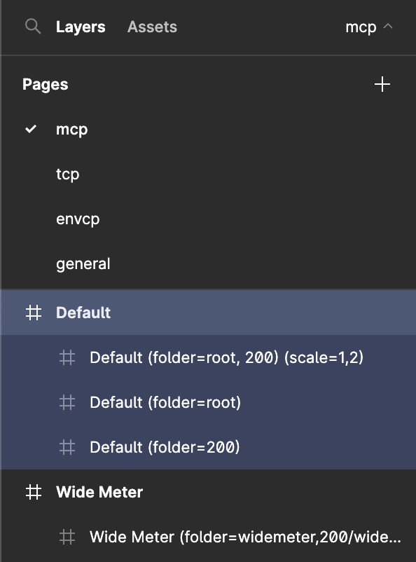
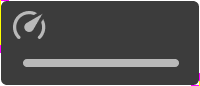
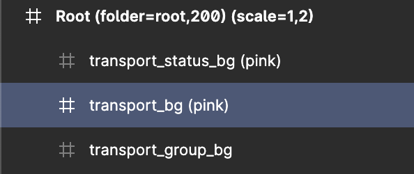
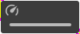

## How to use the plugin

### Install

- In your favorite browser visit: [Slider Creator](https://www.figma.com/community/plugin/1275561670400781749/Slider-Creator)
- Or, search in your App for `Slider Creator` in the Community area
- Click the install button

Congrats, that's step 1.

### Usage

#### intro

This plugin will help you simplify exporting a whole bunch of images into different folders with different scaling. Read more below on how to set it up.

> All images needs to be created in 100%. this will prevent weird artifacts of down scaling.

#### Project setup

Projects can have multiple pages. It is not required of course, but wil probably help you structure your project.
Within a page you can add one or more frames. Each frame can contain multiple images for export. Per Frame you can set the export information; Which folder should it end up in and which scale levels do you need.

In the image an example:
The page mcp has a couple of frames. One of the frames is named default and has 3 other frames as children. The children have export info:

- export to folder `root` with scale `1`
- export to folder `200` with scale `2`

The above will get applied to all the children of this frame.

#### Export options

For the folders there are 2 options to add and these are 'aligned'. This means: when you have 2 folders, you will need 2 scale. The first folder gets the first scale. The second folder the second scale. You can add as many pairs as you want.

The first option is the folder. This looks like:

- `(folder=root)`: This will export the images to the root folder. This is the top level folder. When only having 1 folder and the scale option is not set, all images will be scaled to 100%.
- `(folder=root,200)`: This will export the images to both the root folder and a folder named 200. Having multiple folders requires also the scale option.

The second one is the scale. This looks like:

- `(scale=2)`: This will scale all the images to 200%.
- `(scale=1,2)`: This will scale all the images to 100% and 200% for the corresponding folders.

And now all together:

- `(folder=root,200) (scale=1,2)`: This will move all images to the root folder scaled by 100% and also moves all the images to a folder named 200, scaled by 200%
- `(folder=root,200/default) (scale=2,2)`: This will move all images to the root folder and a folder named 200/default, scaled by 200%

#### Image sizing meta data

In some application you are able to add image sizing metadata in the image. The consists of a 1px border in some places. These define which areas of an image may or may not scale. more info on this can be found on the [REAPER](https://www.reaper.fm/sdk/walter/images.php#imagetypes) website. An example below.

you can add an option to the image name `(pink)`. When you add this to the name and the folder has multiple scales, the plugin will try to keep the pink en yellow lines at 1px. Below an example of the scale 200% and 100%. They are scaled to the same size here, but at the 100% image, the pink and yellow lines have twice the thickness.

While testing this worked best for 100% and 200%. Scaling 150% might result in blurred lines, what will break the resizing.

#### Export the images

Once you've created your images you can export them. First open the plugin. A welcome screen appears. Click `Start your export`.

The screen for selecting the pages appears:

Now you can select the pages you want to export:

Once the pages are selected click teh `Prepare the selection` button. This will prepare all the data for the actual export. You will now see a list of all teh folders to export on the left side. You can click on the folder name to see the list of images for that folder:

Now click `Start Download`, this will create a zip file. You will be asked where to store the file.

And that's it.
